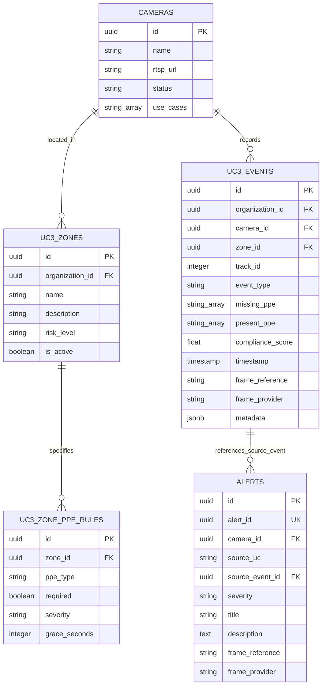

# Innovision Platform — System Architecture Specification (ARCHITECTURE.md)

**Date:** October 6, 2026  
**Target State:** Native UC3 Integration & Multi-Use-Case Video Analytics Platform  
**Repository:** `innovision-platform`  

---

## 1. Architectural Principles & Integration Boundaries

Innovision is a multi-use-case video analytics operations platform. The architecture cleanly separates video stream ingestion, independent use-case (UC) inference, platform alert processing, and operator workflow management.

### Non-Negotiable Directives:
1. **Immutable Standalone Reference**: The standalone `PPE_DETECTION` repository is strictly **READ-ONLY**. All integration code, models, and dependencies are packaged natively inside `innovision-platform/services/uc3`.
2. **Single PostgreSQL Database Architecture**: The platform uses **ONLY ONE PostgreSQL database (`innovision_platform`)**. No separate database containers (`innovision_uc3`, `uc3_db`) are created. UC3 creates its UC3-owned tables (`uc3_events`, `uc3_zones`, `uc3_zone_ppe_rules`) inside `innovision_platform` using Alembic.
3. **Platform Table Isolation**: UC3 reads/writes ONLY its UC3-owned tables. UC3 NEVER writes directly to platform-owned tables (`cameras`, `users`, `alerts`, `incidents`, `audit_log`, `notification_log`, `reports`).
4. **No Unnecessary Platform Table Alterations**: Broad multi-tenancy database alterations across existing platform tables (`cameras`, `users`, `alerts`, `incidents`, `audit_log`) are excluded from the UC3 integration phase.
5. **Real Source Event Traceability**: `AlertEvent.source_event_id` MUST reference an actual UC3 internal event UUID persisted in `uc3_events`. `uc3_events` is the single authoritative UC3 event table (storing `event_type`, `frame_reference`, `frame_provider`, and `metadata`) to fulfill `BaseAnalyticsEvent` traceability. Duplicate event tables (e.g. `uc3_compliance_events`) are explicitly excluded.
6. **Canonical Alert Publishing**: Alerts are published via `AlertPublisher` to Redis stream `alerts:live`. UC3 does not directly call raw Redis `XADD` or write to PostgreSQL `alerts`.
7. **Read-Only Camera Registry Usage**: UC3 reads camera configuration via `GET` endpoints (`GET /cameras/by-uc/uc3`, `GET /cameras/{id}`). UC3 will NEVER call `PATCH /cameras/{id}/status` or modify camera records.
8. **Preservation of Four Use Cases**: UC1, UC2, UC3, and UC4 share the platform infrastructure. UC2 and UC4 services and front-end overlay routes MUST remain fully operational.

---

## 2. End-to-End System Architecture

```text
[ Physical / Virtual Cameras ]
              │ (RTSP / MP4 Video Streams)
              ▼
 ┌──────────────────────────┐
 │  Ingestion Microservice  │
 │  FFmpeg -> Sampler       │
 └────────────┬─────────────┘
              │
      ┌───────┴───────────────────────────────┐
      │ (Hot Path: JPEGs)                     │ (FrameEvent Metadata)
      ▼                                       ▼
┌──────────────┐                  ┌───────────────────────┐
│ Redis Cache  │                  │     Redis Stream      │
│frame_refer...│                  │  frames:{camera_id}   │
└──────┬───────┘                  └───────────┬───────────┘
       │                                      │
       └──────────────────┬───────────────────┘
                          │
                          ▼ (Consumer Group: uc3_group via XREADGROUP)
             ┌──────────────────────────┐
             │   Integrated UC3 Service │
             │  (services/uc3/main.py)  │
             └────────────┬─────────────┘
                          │
          ┌───────────────┼───────────────────────────────┐
          ▼               ▼                               ▼
  ┌───────────────┐ ┌───────────────┐           ┌──────────────────┐
  │ Persist Event │ │ Upload Image  │           │  AlertPublisher  │
  │ (uc3_events)  │ │ (MinIO)       │           │  (alerts:live)   │
  └───────┬───────┘ └───────┬───────┘           └────────┬─────────┘
          │                 │                            │
          ▼                 ▼                            ▼
  ┌───────────────┐ ┌───────────────┐           ┌──────────────────┐
  │   Postgres    │ │ MinIO Bucket  │           │ Alert Management │
  │(innovision_pl)│ │innovision-sn..│           │    Service       │
  └───────────────┘ └───────────────┘           └────────┬─────────┘
                                                         │
                                                         ▼
                                                ┌──────────────────┐
                                                │   Postgres DB    │
                                                │ (alerts table)   │
                                                └────────┬─────────┘
                                                         │
                                                         ▼
                                                ┌──────────────────┐
                                                │  React Dashboard │
                                                │ Overlay + Alerts │
                                                └──────────────────┘
```

---

## 3. Runtime Zone-Based PPE Flow Architecture

The backend/runtime engine operates with zone-aware PPE policies independently of whether a frontend Zone Management UI is mounted.

```text
Camera / Track
      ↓
Determine camera's bound zone_id (or fallback default zone)
      ↓
Fetch required PPE rules for zone (from DB table uc3_zone_ppe_rules or fallback config)
      ↓
Pass zone-required PPE types (frozenset[PpeTypeId]) into compliance.evaluate_compliance()
      ↓
Calculate missing/present PPE, compliance state, and compliance score
      ↓
Persist internal UC3 event into PostgreSQL table `uc3_events` (returning uc3_event_id)
      ↓
Publish canonical AlertEvent (with source_event_id = uc3_event_id) to Redis alerts:live
```

---

## 4. Single Database Architecture (`innovision_platform`)

UC3 tables exist alongside platform tables inside `innovision_platform`:



---

## 5. FrameEvent Consumption & Frame Provider Resolution

UC3 consumes Redis stream `frames:{camera_id}` using `XREADGROUP`:
- **Consumer Group**: `uc3_group`
- **Consumer Name**: `uc3_worker_{hostname}`
- **Processing Logic**:
  1. Deserialize payload into `FrameEvent` Pydantic model (`event_id`, `camera_id`, `frame_seq`, `timestamp`, `frame_provider`, `frame_reference`, `frame_shape`).
  2. Inspect `frame_provider` and use `frame_reference` directly (without hardcoding key patterns):
     - If `frame_provider == "redis"`: Fetch JPEG bytes from Redis using `frame_reference`.
     - If `frame_provider == "minio"`: Download object from MinIO bucket `innovision-frames` using `frame_reference`.
  3. Decode JPEG bytes (`cv2.imdecode`) and execute inference pipeline.
  4. Acknowledge message using `XACK` only after inference, event persistence, snapshot upload, and alert publishing complete successfully.

---

## 6. Dashboard Bounding Box Letterbox Transformation

To ensure visual parity with `PPE_DETECTION`, `CameraOverlay.tsx` calculates aspect-ratio letterboxing offsets before drawing boxes on the HTML5 canvas (no PPE detection logic in React):

```typescript
// Container Dimensions
const containerW = container.clientWidth;
const containerH = container.clientHeight;

// Video Element Dimensions & Aspect Ratio
const videoW = videoElement.videoWidth || 1920;
const videoH = videoElement.videoHeight || 1080;
const videoAspect = videoW / videoH;
const containerAspect = containerW / containerH;

let displayedW = containerW;
let displayedH = containerH;
let offsetX = 0;
let offsetY = 0;

if (containerAspect > videoAspect) {
  // Pillarboxed (vertical bars on left/right)
  displayedW = containerH * videoAspect;
  offsetX = (containerW - displayedW) / 2;
} else {
  // Letterboxed (horizontal bars on top/bottom)
  displayedH = containerW / videoAspect;
  offsetY = (containerH - displayedH) / 2;
}

// Transform Normalized Coordinates (0.0 - 1.0) to Canvas Pixels
const canvasX = offsetX + bbox.x1 * displayedW;
const canvasY = offsetY + bbox.y1 * displayedH;
const canvasW = (bbox.x2 - bbox.x1) * displayedW;
const canvasH = (bbox.y2 - bbox.y1) * displayedH;
```

---

## 7. API Specification for UC3

### 7.1 Overlay Detection API
```http
GET /uc3/cameras/{camera_id}/latest-detections
```
**Response (JSON)**:
```json
{
  "timestamp": "2026-10-06T14:20:00Z",
  "camera_id": "00000000-0000-0000-0000-000000000003",
  "detections": [
    {
      "track_id": 7,
      "label": "Person",
      "bbox": { "x1": 0.25, "y1": 0.10, "x2": 0.55, "y2": 0.85 },
      "color": "#94A3B8",
      "compliant": false,
      "missing_ppe": ["helmet"],
      "present_ppe": ["vest", "shoes"]
    },
    {
      "label": "Vest",
      "bbox": { "x1": 0.30, "y1": 0.30, "x2": 0.50, "y2": 0.60 },
      "color": "#FF8A3D",
      "compliant": true
    }
  ],
  "zone": {
    "name": "Assembly Zone A",
    "required_ppe": ["helmet", "vest", "shoes"]
  }
}
```

### 7.2 Health & Metrics Endpoints
- **`GET /health`**: Returns `{ status: "ok", model_loaded: true, redis_connected: true, last_frame_age_seconds: 0.12 }`.
- **`GET /metrics`**: Exposes Prometheus metrics (`frames_consumed_total`, `frames_processed_total`, `alerts_published_total`, `inference_latency_seconds`, `stream_lag`, `errors_total`).
